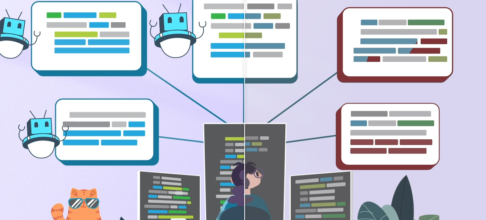

You're upgrading dependency for a project, however, this upgrade needs unfathomable modification and refactoring?

In this article we go over:
- How codebase migrations can be problematic?
- What are codemods and how do they solve this issue?
- How do codemods work?
- Types of codemods.
- References for getting started with your first codemod!

<!--truncate-->

---


So you're working on a project, and for some reason, you need to upgrade/change a dependency. But by doing so, you realize that you have a lot of rework and refactoring to do in your codebase.

It feels like you've been hit by a truck. How can you go over this huge codebase and re-read, inspect, analyze, and rewrite all this code; all just for a simple dependency change?

Let alone that this will most probably happen again when another dependency usage changes sometime soon. 😈

Huge inconvenience! Certainly, the amazing coders out there won't leave us in the open without a solution to this, right? Fear no more.


## I'll Find & Replace, What's the Issue? 😎 (Hint: A Lot!)

You might like living on the edge and think about going wild with a find & replace to do all the needed changes in this scenario, but then a few replace in and found that you're either already breaking the code or trying to take care of so many special cases that it's infeasible. (This is our "we told you so moment").

<p align="center"></p>

<div align="center">

Imagine if you have a piece of code like this in your program:

<p class="max-width-300" align="left">

```jsx
let hello = "world";

function sayhello(){
    console.log("hello world");
}
```

</p>

And in every part of your program, the variable ***hello*** needs to be changed &rarr; ***world***.

</div>

That would be quite problematic, wouldn't it?

First of all, you're not sure which hello's should be replaced, and which shouldn't.

Even then, simply finding and replacing will lead to replacing parts of the program that shouldn't be replaced; causing so much hassle and eventually leading to manual work.

So what's the solution? 😞


## Enter, Codemods! 🥳

Before you start chugging gallons of coffee ☕ and bashing on your keyboard ⌨️, wasting all those precious hours, you hear about codemods. Suddenly the light comes back into your life. 🌟

Codemods, short for code modifications, is a term first coined by facebook for tools/libraries for large-scale codebase refactors.

Codemods automate the tedious work of re-structuring your code for something like a dependency change by automatically converting and migrating your codebases easily.

Codemods leverage (very) mature analysis and structuring techniques to build new cutting-edge workflow efficiency scripts.

Codemods work by creating ASTs (Abstract Syntax Trees) of your code, manipulating/re-structuring those trees, and re-writing your code using those new trees. 🌲
<p align="left" class="inverted-grey"></p>


Well, this sounds a bit overwhelming, but all of this is just a fancy way of saying that codemods go over your code then:
1. Tokenizes it (or splits it into small chunks 🍪)
<p align="left" class="inverted-grey"></p>
2. Uses those tiny pieces to create a tree that resembles how your code looks like in a complete structural point of view.
<p align="left" class="inverted-grey"></p>
3. Finally uses that tree to manipulate the code & doing all the needed fixes then creating new code off of that tree.
<p align="left" class="inverted-grey"></p>

Leaving you with refactored & working code in no time, Voila! 🪄 

All in all, codemods use tokenize your code, built ASTs with those tokens, then manipulate those ASTs based on given rules, and give you a migrated new fresh working code. ✨

<div class="flex-row">

<div class="flex-column">

```jsx  title="Before Change"
// red line
let hello = "world";

function hello(){
    console.log("hello world");
}
```

</div>

<div class="flex-column">

```jsx  title="After Change"
// green line
let world = "world";

function hello(){
    console.log("hello world");
}

```

</div>
</div>


## Methods of Codemods Generation

There are 3 methods of codemod generation you can go about.

1. Imperative-Based Codemods
2. Declarative/Pattern-Based Codemods
3. LLM-Based (Large Language Models) Codemods


### Imperative-Based Codemod Engines
This type of codemod generation is very powerful & enables the codemod author to tailor the codemod for many types of complex code transformations. However, imperative-based codemod generation requires deep understanding of ASTs & their manipulation techniques.

An example of this method is using [ASTExplorer](https://astexplorer.net/) to manually inspect the AST, select nodes, filter nodes, modify them, & create a code transformation.


### Declarative/Pattern-Based Codemod Engines
These types of codemod engines are much easier to use compared to imperative-based engines. Declarative-based engines rely mainly on input/output states of code that allow the declarative engine to find specific patterns of code transformation between both states.

Declarative-based codemod engines hide much of the underlying implementation details, allowing a much more human-understandable method of codemod generation. However, declerative codemod engines still rely on ASTs for code transformations and are limited to supporting changes only when atomic tranformations are already built.

An examples of a declarative codemod engine is [JARVIS](https://rajasegar.github.io/jarvis/).

### LLM-Based (Large Language Models) Codemod Engines
LLM-based codemod engines allow codemod generation to be a data-driven process of providing examples of before & after code states.

These codemod engines skip the use of ASTs to develop transformations, and rather work by a direct code-to-code transformation.

However, such models are rarely suitable for any complex tranformations, and are rather used only for simple transformations. To add, human review is needed to ensure that the code transformation is accurate. 

Despite this, LLM-based codemod are getting increasingly smarter over time. Currently, there are extremely promising results that illustrate great efficacy of using LLMs in simple code transformations.

## Learn How to Write Your First Codemod

Check out our guide here to ***[learn how to write your first codemod](/docs/guides/write-codemods-like-a-pro)***!


## Share Your Codemods With The Amazing Community 👩🏽‍💻🌎


Check out our guide here to ***[integrating your codemod into intuita](/docs/guides/integrate-codemod-in-intuita)***!
